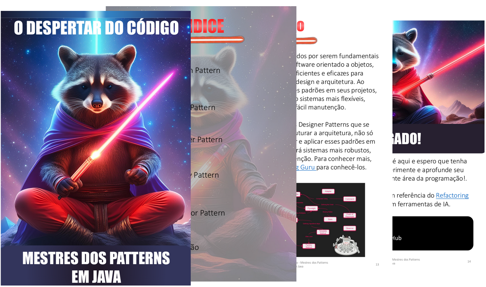

# Projeto EBOOK Gerado por I.A.s

-------

 > ℹ️ **NOTE:** Este é o repositório desenvolvido durante o Bootcamp Santander IA para Devs na qual participei na plataforma da [DIO](https://dio.me)

Projeto com o objetivo de gerar um ebook digital com as facilidades das ferramentas de IA. Segue todos os prompts utilizados:

<a href="https://github.com/willdkdevj/ebook-designer-pattern-1/blob/main/output/E-book%20-%20O%20Despertar%20do%20C%C3%B3digo%20-%20Mestres%20dos%20Patterns.pdf" title="View PDF now"> 📕Clique aqui para ler</a>

## 💻 Tecnologias utilizadas no projeto

- [ChatGPT](https://chat.openai.com/) 
- [Adobe Firefly](https://www.adobe.com/br/products/firefly/features/text-to-image.html)
- [PowerPoint](https://www.microsoft.com/en/microsoft-365/powerpoint)

## 🧠 Prompts

ChatGPT：

|   Ação   | prompt                                                                                                                                                                                                                                                                         |
| :------: | ------------------------------------------------------------------------------------------------------------------------------------------------------------------------------------------------------------------------------------------------------------------------------ |
|  título  | Crie um titulo de e-book sobre Designer Pattern com Java, o e-book é sobre o nicho de programação e o subnicho é Java, o titulo deve ser épico e curto, e tenha uma temátia mais da cultura geek                                                        |
| conteúdo | Desenvolva um texto para ebook, com o foco em Designer Patterns, listando os principais partterns utilizados em arquitetura de software com exemplos de códigos em java

[REGRAS]
* Explique de modo que desenvolvedores juniors entendam
* Deixe o texto enxuto
* Utilize sempre o mesmo contexto para os exemplos
 |

Midjourney：

|  Ação  | prompt                                                                                 |
| :----: | -------------------------------------------------------------------------------------- |
| Título | a raccoon raccoon with a red jedi lightsaber meditating in space, pixel art style      |

## ✨ Features

- Conteúdo gerado via ChatGPT v3.5
- Imagens geradas via Adobe Firefly

## 📚 Materiais

- Imagens utilizadas em `assets`
- ebook gerado durante as aulas em `output`

## 🛠️ Instruções de execução

Utilize os prompts acima nas ferramentas sugeridas para gerar o material base e utilize uma ferramenta de edição de documentos como power point, libreoffice , indesign para diagramação.

## 👨‍💻 Expert

    
    
&nbsp&nbsp&nbspWilliam Derek 
    &nbsp&nbsp&nbsp
    <a href="https://github.com/willdkdevj">
    GitHub</a>&nbsp;|&nbsp;
    <a href="https://www.linkedin.com/in/william-derek-dias/">LinkedIn</a>
&nbsp;|&nbsp;
    

  

